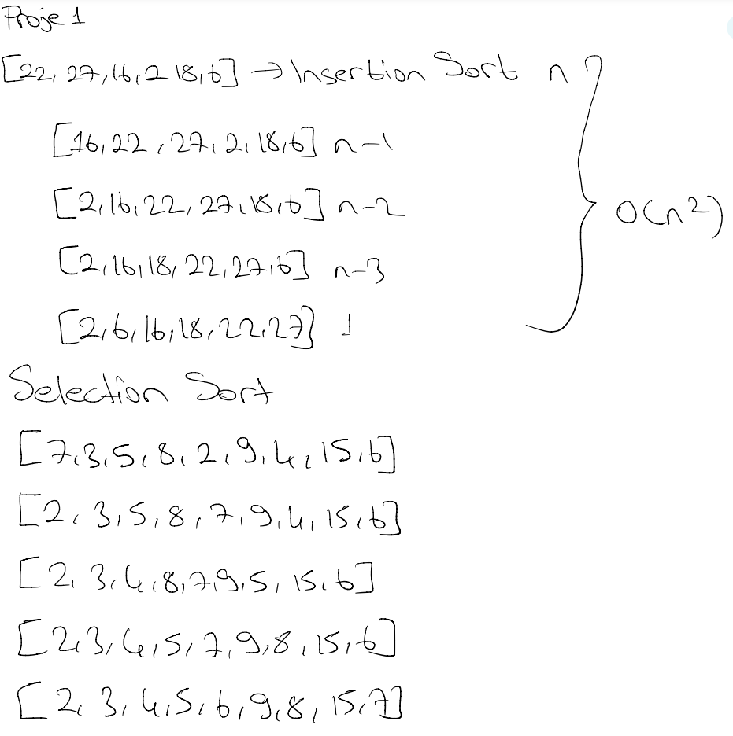

# Proje 1

[22,27,16,2,18,6] -> Insertion Sort

Yukarı verilen dizinin sort türüne göre aşamalarını yazınız.

Big-O gösterimini yazınız.

[7,3,5,8,2,9,4,15,6] dizisinin Selection Sort'a göre ilk 4 adımını yazınız.

